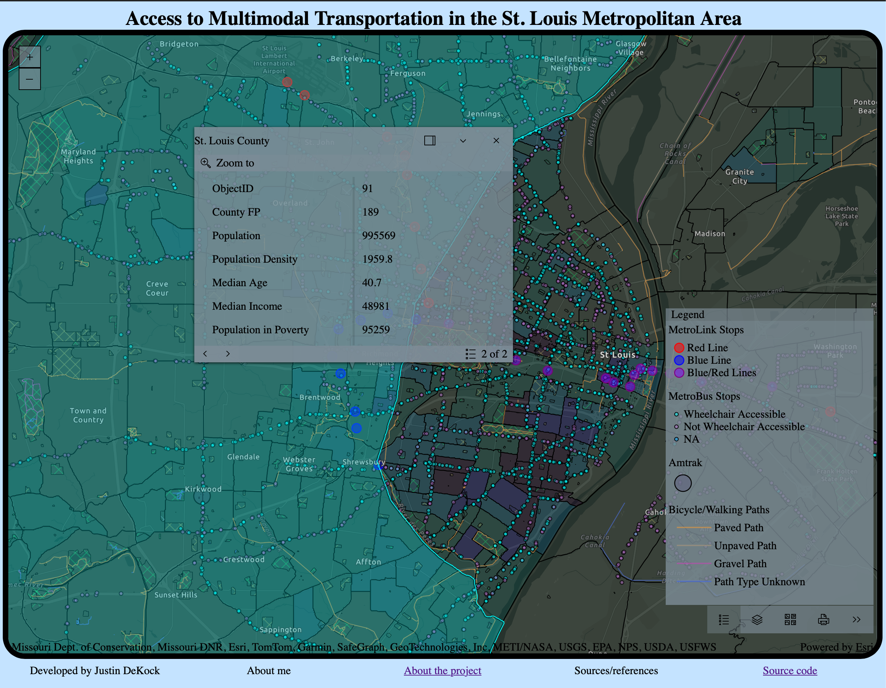

# stl-transit
### <i>IN EARLY DEVELOPMENT</i>
Interactive Map of multi-modal transportation options in the St. Louis Metropolitan Statistical Area. Powered by the ESRI ArcGIS Maps SDK for JavaScript. Users can explore relationships between transit access and various dependent variables. For more details, see the [scope](/z_docs/SCOPE.md) document
- Repo organization details are explained in the [repo](/z_docs/REPO.md) document
- High level technical details can be found in the [stack](/z_docs/STACK.md) document

## Latest working example: 
 

## REPO CONTENTS
- ### Dockerfile, compose.yaml
    - root Dockerfile builds Go API service
    - compose builds all persistent services, one-off services also can be run to import data
- ### BACKEND DIRECTORIES
    - /src
        - Go main package
    - /pkg
        - Other Go packages
- ### FRONTEND DIRECTORY: /www
    - STATIC HTML
    - /src
        - TypeScript source directory
    - /js
        - JavaScript artifacts, transpiled/bundled
    - /css
        - Global style sheets 
- ### DATABASE DIRECTORY: /db
    - Dockerfile
        - builds Postgres image
    - gtfs.Dockerfile
        - builds node image to import GTFS data into db
    - osm.Dockerfile
        - builds image to load OSM data into db
    - /dump
        - Postgres dumps
    - /initdb
        - sql/shell scripts run on database creation
- ### SCRIPTS DIRECTORY: /scr
    - Contains various bash scripts primarily for importing external data into or backing up the database

## HOW TO RUN LOCALLY
The project can be built/run locally with [Docker](https://www.docker.com/products/docker-desktop/). The [docker compose file](./compose.yaml) builds the Go api, Postgres DB, and transpiles the TypeScript to JavaScript files that are served by the nginx container. Follow the steps below to run locally
- #### First, clone the repo and enter the stl-transit directory:
    `git clone https://github.com/jdetok/stl-transit` 
    `cd stl-transit`
- #### From compose.yaml:
    1. Ensure docker is installed - if you're on Mac/Windows, be sure to install docker desktop
    1. build the database:  
        `docker compose up --build postgis` 
        - if building the database from scratch, the scripts in /db/initdb will be run
    1. import ACS, TIGER, GTFS, and OSM data
        - The easiest way to do this is to run the scripts in /scr within the running postgis container
            - /scr in the repo is mounted to /scr in the container, so the scripts can be run within the container
        1. Once the postgis service is running and healthy, create an interactive terminal for the running container
             `docker exec -it pgis bash` 
            * <b>ALL COMMANDS WILL BE RUN IN THIS TERMINAL UNTIL OTHERWISE NOTED</b>
        1. Import county/census tract polygon data from TIGER shapefiles
             `./scr/tgr` 
        1. Import per-census tract data from the 2024 ACS 5 Year dataset
             `./scr/acs` 
        1. Import GTFS data from STL Metro
             `./scr/gtfs` 
        1. Import Open Street Map data
             `./scr/osm` 
        1. Finally, close the interactive terminal into the container with Ctrl+D. All commands going forward are run on the host computer
    1. build and run the Go API and nginx proxy containers: 
        `docker compose up --build api proxy`
    1. app should be running at http://localhost:3333